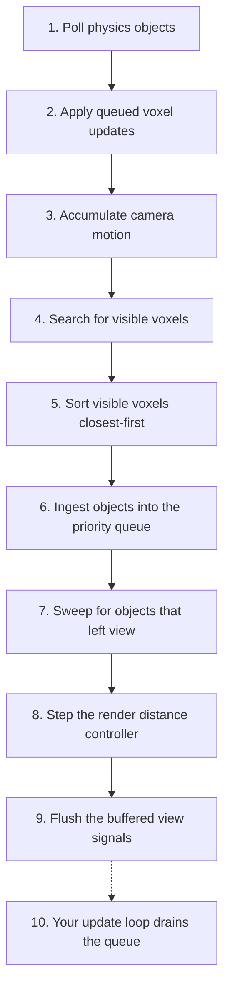

# How CullThrottle Works

This document explains the logic of CullThrottle: what it does each frame, the order it does it in, and why each piece is built the way it is. The [README](../README.md) covers the API, supported object types, and best practices. [MATH.md](./MATH.md) covers the formulas and proofs behind the mechanisms described here.

By the end, none of it should look like magic.

## Part I: The problem

### 1. What CullThrottle is for

Suppose your game has fifty thousand objects that each want a small per-frame effect: spinning, bobbing, flickering, pulsing. A frame at 60 FPS gives you about 16 ms for everything the game does, and a loop that merely touches 50,000 objects, before doing any real work on them, already eats a meaningful slice of that. Updating them all every frame is out of the question.

But almost none of those objects are on screen. The player sees a few hundred at a time, and of those, the big nearby ones matter far more than the distant specks. The work you need to do each frame is small. The hard part is figuring out which work that is, fast enough that the figuring saves more than it costs.

That is CullThrottle's job. Given a set of objects, it schedules per-frame updates that prioritize higher-importance objects within the fixed time budget:

```Lua
for object, dt, distance, cframe in throttler:IterateObjectsToUpdate() do
    -- Advance this object's effect by dt.
end
```

The name CullThrottle describes the two parts of the system. It culls, so objects outside the view don't waste compute. And it throttles, so compute is spent on the most important visible objects first, each one earning its own refresh rate based on how much it matters right now. There are also `ObjectEnteredView` and `ObjectExitedView` signals for effects that only care about appearing and disappearing.

Three terms recur, so here is what they mean. Visible means inside the camera's view frustum, within the render distance, and not hidden behind a tagged occluder. Visibility is decided per voxel (a cube of world space, defined in section 4) rather than per object, so it errs a little conservative, and section 9 covers the per-object refinement. Refresh rate is how often a particular object comes back through the update stream. You configure a range (15-60 Hz by default) and CullThrottle moves each object within it. A budget gives each phase a time allowance, checks progress mid-work, and falls back to a defined behavior if time runs out.

### 2. Two ideas that shape everything

Almost every design choice in CullThrottle traces back to one of these two principles.

The first idea is that every phase runs under a fixed time budget with a graceful fallback. The frame never waits for a perfect answer. Each phase front-loads its most valuable work then falls back to a reasonable approximation when time runs out, reusing stale results or deferring what's left. Deferred work gains urgency the longer it waits, so the system corrects itself over the next few frames. Section 15 collects all of these fallbacks in one place.

The second idea is that consecutive frames are nearly identical, so it pays to prove when answers remain true instead of recomputing them. Between two frames, the camera usually moves a few studs and turns a fraction of a degree, meaning nearly everything visible in the last frame is still visible now. The hard part is knowing exactly which ones. Caching answers for a fixed time is wrong (the camera can teleport), and invalidating on any camera change is useless (the camera always moves a little). CullThrottle's answer is to make every visibility test report, alongside its verdict, how much camera motion that verdict survives. Checking whether a cached answer is still trustworthy then costs a single comparison. Section 6 builds this up.

### 3. One frame at a glance

CullThrottle does its work once per frame, normally in `RunService.PreRender`, though in the on-demand mode (covered in section 11) the frame's first query runs it instead. The diagram below maps the whole pipeline, and section 14 revisits it with full context.



1. Poll physics objects, so parts moved by the physics engine have fresh positions (section 13).
2. Apply queued voxel updates, moving objects between voxels to match where they've gone (sections 4 and 13).
3. Accumulate camera motion, advancing the running totals that every cached visibility answer is judged against (section 6), then rebuild the occluder umbrae from the camera's new position, or reuse the built ones while the camera stays within their erosion pad (section 8).
4. Search the grid for every occupied voxel that intersects the view frustum and isn't hidden behind an occluder (sections 7 and 8), or replay the previous frame's result outright when nothing that feeds the search has changed (section 7).
5. Sort the visible voxels closest-first (section 9).
6. Ingest the objects in those voxels, scoring them into a priority queue (section 9).
7. Sweep for objects that have stayed out of view long enough to count as gone (section 11).
8. Step the render distance controller, growing or shrinking the render distance based on how the budgets are holding up (section 12).
9. Flush the entered and exited view signals buffered during the frame (section 11).
10. This belongs to you: whenever your code iterates `IterateObjectsToUpdate`, it drains the queue under its own budget and runs your loop (section 10).

## Part II: Deciding what's visible

### 4. Dividing space: voxels and buckets

Testing each object against the camera individually is exactly the 50,000-iteration loop we said we can't afford. So CullThrottle doesn't decide visibility per object at all. It divides the world into a uniform grid of cubic voxels, each 100 studs on a side by default, and decides visibility per voxel. Objects are assigned to the voxels they occupy, and when a voxel is visible, its objects become candidates for updating. The cost of visibility now scales with how much occupied space the camera can see rather than with how many objects exist. A thousand objects packed into one room cost only one voxel verdict.

Which voxels does an object occupy? Most objects are small relative to a 100-stud voxel, so they live in exactly one (the voxel holding their center) and moving across a boundary is a cheap single reassignment. The single voxel is a slight simplification, since a small object can poke past it into a neighbor, but the overhang is bounded at a quarter of the voxel size (that bound is exactly the threshold below which an object counts as small), and a sliver that thin only matters for an object hugging a voxel boundary at the edge of the view.

An object whose bounding radius passes that threshold instead occupies every voxel it overlaps. The subtlety is that its bounding box is oriented. For a long part rotated 45 degrees, the world-aligned box around it bulges far past the real shape, and filling that box would claim corner voxels the object doesn't touch. So the world-aligned box only nominates candidate voxels, and a separating-axis test eliminates candidates that don't touch the object (detailed in [MATH.md](./MATH.md)). The test checks the box's own face axes and omits the edge-to-edge cross axes a full check would require, so it may retain a thin sliver of corner voxels the box doesn't actually touch. That error direction is deliberate, since an extra voxel costs a little bookkeeping while a wrongly excluded one could hide an object from the search.

A bucket index sits on top of the voxel grid scale to large render distances. Each frame, the search must find occupied voxels near the frustum, and at a large render distance the frustum's bounding box can span tens of thousands of voxels, likely mostly empty. Scanning empty space is pure waste, and it grows cubically as the render distance grows. So occupied voxels are also indexed into coarse buckets, where each bucket covers a 4x4x4 block of voxels, and the grid maintains a bounding box around the occupied buckets. The per-frame scan walks only the bucket coordinates inside both the frustum's bounding box and that occupied-bounds box. An empty bucket coordinate costs one missed table lookup and an occupied bucket hands over only the voxel keys that actually hold objects. The bucket layer makes that walk 64 times coarser than scanning voxels directly, and the occupied-bounds clamp keeps a long render distance from expanding the search range past where anything actually is.

```txt
+-----------------------------------------+
|  the bounding box of occupied buckets   |
|                                         |
| +=========+=========+       +=========+ |
| | x . . . | . . . . |       | . . x . | |
| | . x . . | . . . x |       | . . . . | |
| | . . . . | . x . . |       | . x . . | |
| | . . . . | . . . . |       | . . . . | |
| +=========+=========+       +=========+ |
|   bucket    bucket            bucket    |
|                                         |
+-----------------------------------------+

x = an occupied voxel. Empty voxels and empty buckets are
not stored, so an empty coordinate costs the scan one missed
lookup, and the outer bounds keep a long render distance
from dragging the scan past where anything actually is.
```

To keep the vocabulary straight, a voxel always means the small grid cube that holds objects, a bucket always means a 4x4x4 group of voxels, and a box is a geometric shape being handed to a test. Section 7 adds the last spatial term, the search volume, for a box of space the search is still working on.

How the grid stays correct as objects move, resize, and despawn is bookkeeping, and it's covered with the rest of the lifecycle machinery in section 13. For now, assume every object is in the right voxels.

### 5. The frustum test, and what it really returns

Now that we have voxels and buckets, we need a way to ask whether a given box of space is on screen.

The camera's view is a frustum, a pyramid spreading out from the camera. CullThrottle describes it with five planes: left, right, top, bottom, and far, where the far plane sits at the render distance. There is no near plane because the four side planes all pass through the camera position, so everything behind the camera already fails at least one side test. A near plane would be a sixth test that rejects nothing new.

The frustum planes are built once per frame directly in voxel coordinates (positions divided by the voxel size, while normals are unchanged by uniform scaling), so every test works on voxel-space boxes with no unit conversion. Per box, a cheap bounding-sphere comparison settles the clearly-inside and clearly-outside cases, and only when the sphere straddles a plane does the exact box projection get computed. [MATH.md](./MATH.md) covers these in more detail.

Every verdict comes back with the clearance that proves it, which we call "slack". An outside verdict comes with how far beyond the rejecting plane the box sits. An inside verdict comes with how far inside the nearest plane the box sits. And a box straddling a plane gets its exit clearance, meaning how far the planes would have to sweep before the box could fall entirely outside.

```txt
                far plane
+--------------------------------------+
 \                                    /
  \                +-----+           /
   \               | box |- slack ->/
    \              +-----+         /
     \                            /
      \                          /
                . . .
               (camera)

The box is inside all five planes, with this much room to
spare before the nearest one.
```

A verdict with slack has a shelf life: it stays true until the camera has moved enough to use up the slack. Section 6 turns that into a cache mechanic.

### 6. Remembering what we proved: motion proofs

The camera moved a little since the last frame, which means almost every voxel's verdict is still true. Which ones can we trust without re-testing? This is the centerpiece of the system.

Slack is a motion allowance. A box confirmed inside the frustum with 3 voxels of clearance is guaranteed to remain inside for any camera motion that shifts the frustum planes fewer than 3 voxels relative to that box. It doesn't matter whether the camera slid, turned, or zoomed, as long as the total plane sweep can be bounded. So a verdict plus its slack reads as "valid until the camera has moved more than this much". The same holds for outside verdicts and their rejection margins.

CullThrottle keeps three running totals of camera motion since the cache was last reset: translation (in voxel units), rotation (in radians), and render distance change (tracked separately since it only affects the far plane of the frustum). These accumulators are one-way odometers that monotonically increase. Changes to the field of view or viewport aspect ratio rotate the frustum's side planes about the camera by the change in half-angle, so the rotation odometer tracks projection changes too. Shrinking the field of view is equivalent to rotating all side planes inward.

Rotation can't be charged at a flat rate because the number of planes it sweeps scales with distance. One degree of camera turn barely moves the planes relative to a nearby voxel, but sweeps them a long way past a voxel 2,000 studs out just like the outside of a wheel moves faster than the middle. So each proof charges rotation based on its own arm, the voxel's distance from the camera. But translation can carry the camera away from the voxel while the proof is still valid, which would lengthen the arm and undercut the cost estimate. To prevent this, the stored arm is padded by the allowance itself, so the charge remains an overestimate in every reachable case. [MATH.md](./MATH.md) has the soundness argument.

Checking a proof's validity comes down to a single comparison. Each proof is stored as an expiry, the odometer reading beyond which it can no longer be trusted. Checking a proof means taking the current translation total, adding the rotation total multiplied by the proof's arm, and comparing against the expiry. That multiply, add, and compare is the entire cost of reusing still-valid work, far cheaper than even the fastest intersection test.

The safest error direction is always to "expire early". Each voxel's proof packs three components into a single Vector3: a visible expiry, a culled expiry, and the arm. A proof only ever carries one verdict at a time (either visible or culled), so the other expiry slot holds a sentinel saying it proves nothing in that direction. `Vector3` components are 32-bit floats, and rounding could nudge an expiry either direction, so every stored clearance is shaved by a small safety margin (0.01 voxels) before storing. The clearance is also capped (8 voxels) to limit the arm's padding and how stale the proof can grow.

A proof can expire sooner than the math strictly requires, but never later. A wrong "expired" verdict costs one redundant test, while a wrong "still valid" verdict would cause a real visibility bug. And when no motion bound can relate the old planes to the new ones at all, the cache drops everything and re-anchors the odometers at zero. A cache reset happens in three cases: the camera object is replaced, the voxel size changes (since every cached quantity is stored in voxel units), or the odometers grow large enough that f32 precision threatens the safety margin (roughly 16,000 combined voxels of translation and render distance change, or 64 radians of rotation). Each reset costs one cold frame, which the budgets absorb by design.

Proofs are cached at two granularities. Each voxel gets the packed proof described above. All three of its slots are spoken for, leaving no room to split clearances by plane, so a render distance change charges voxel proofs at full weight, the same as translation. Each bucket can also cache a verdict for its whole box, but only the two durable states: fully outside or fully inside. Bucket verdicts live in plain table fields rather than a packed `Vector3`, so they skip the cap (there's no packing precision to guard) and they keep side-plane and far-plane clearances separate. Because a render distance change moves only the far-plane (section 12 explains why the render distance is always changing), it spends only far-plane clearance. A bucket straddling the frustum boundary has no durable verdict because the smallest camera motion can flip individual voxels inside it, so straddling buckets are re-searched every frame until they clear the boundary.

### 7. The search: spending the budget cheapest-proof-first

Now we have a grid (section 4), a test that yields durable proofs (section 5), and a cache of proofs with one-comparison validity (section 6). The search's job is to find every visible occupied voxel in under a millisecond (0.8 ms budget by default). It runs in three layers ordered so that the cheapest possible resolution handles as much space as possible.

The first layer seeds from the buckets. The search scans occupied buckets inside the frustum's bounding box (clamped to the occupied bounds). A bucket with a still-valid cached verdict resolves in two comparisons: culled means skip it entirely, and inside means bulk-append every voxel key in the bucket to the visible set. The verdict is about the bucket's box, so it even covers voxels that became occupied after the verdict was proven. A bucket with no valid verdict gets its full box classified by the frustum test, and a fully outside or fully inside result is cached with its clearances and resolved on the spot. Only a straddling bucket requires further work. Its voxel keys are copied into a shared buffer, and a root search volume covering that contiguous slice of the buffer is pushed onto a stack. A search volume is a box of space the search hasn't settled yet, paired with the buffer slice holding the occupied voxel keys inside it.

In a typical frame, the vast majority of buckets are either far outside the view or comfortably inside it, so this layer resolves most of the world for a couple of comparisons per bucket. All that remains is a thin shell of buckets straddling the frustum boundary.

The second layer subdivides the straddling volumes. Volumes are popped from the stack and resolved in one of two ways. The cheap way is a proof walk, which checks each voxel in the volume against its cached proof. Still-valid visible voxels are appended, still-valid culled voxels are skipped, and unproven voxels (expired or missing proofs) are re-tested. If the walk finds that unproven voxels outnumber proven ones by some margin, we know the volume is mostly cold so the walk stops immediately. Instead, we re-test the volume’s bounding box. This ends up faster on average since many cases are entirely inside/outside and only need the one box test. A fully outside result stamps every voxel in the volume as culled, giving each a proof that carries the box's rejection margin and uses the voxel's own arm. A fully inside result stamps them all visible the same way, giving each a proof carrying the box's slack. A straddling result splits the box roughly in half along its longest axis and rearranges the voxel keys in the shared buffer so each half owns a contiguous sub-slice for the next round.

This recursive split in the straddling case stays cheap through proof inheritance. Each child only re-tests the planes its parent straddled. If the parent cleared a plane entirely, the child must too and skips it. The child also inherits the tightest slack any ancestor proved, so proofs stamped deep in the tree have their clearance correctly bounded by every plane without re-testing any of them.


```txt
a search volume's keys live in one shared buffer slice:

  [ k1  k2  k3  k4  k5  k6 ]     the search volume owns this range of the buffer

A straddling result splits the box along its
longest axis and partitions in place:

  [ k2  k5  k1 | k6  k3  k4 ]
      child A      child B       each child volume owns its sub-slice for the next test
```

The third layer is single voxels, where a volume clipped down to one voxel trusts a still-valid proof of either verdict, or frustum-tests the voxel and stamps a fresh proof.

Two more measures handle cases where the budget runs out before the search completes. The first is the budget fallback. The clock is sampled every few volumes rather than after each one, since reading the clock itself has a cost. When the budget expires with volumes still on the stack, each remaining voxel is re-marked visible if its last verdict was visible, without re-validating it. Assuming still visible is the right bias, since an object flickering invisible for a frame is worse than spending an update on something that slipped out of view. The number of voxels handled by this fallback is recorded, and section 12 explains what's watching that number.

The second safety measure is a fairness rotation. The stack is last-in-first-out, so the top volume gets the front of the budget. A counter rotates which root volume is processed first each frame and alternates the push order of child volumes. When the budget consistently falls short, this ensures every straddling volume eventually gets a fresh search in turn, rather than one corner of the view always consuming the budget while another runs indefinitely on stale proofs.

Above all three layers sits a whole-frame replay for the case where nothing moved at all. The pass is a deterministic function of the camera's frustum, the set of occupied voxels, the built umbrae, and the cached proofs, so when every one of those stands exactly where the last complete pass left it, re-running the search could only reproduce the same output, and the frame hands back the previous visible set instead. The gate checks a handful of counters: all three motion accumulators and the flush count (any charged translation, rotation, projection change, or render distance change breaks it), an occupancy generation the grid bumps whenever a voxel is created or emptied (an object joining or leaving an already occupied voxel doesn't break it, since the output names voxels rather than their contents, and ingest reads contents fresh either way), the umbra build count and both occlusion generations (an umbra reuse frame qualifies, a rebuild doesn't), and the occluder cap itself, since flipping the cap re-decides whether cached occlusion proofs are honored at all. A pass the budget truncated never arms the replay, because its output leaned on the stale-verdict fallback rather than the watched inputs alone. There's no approximation here and no error direction to track, since the gate demands bit-identical inputs, and the caches don't age while it holds (the odometers aren't moving). A replayed frame also skips re-sorting the visible voxels, since the sort's only inputs (the pending keys and the camera's voxel) are pinned by the same bit-identical accumulators, so the anchor pass's order still stands. What it buys is the common case of a parked camera in a quiet scene, where the search phase drops to a few comparisons.

### 8. Occlusion culling: proving space hidden

The frustum test asks whether a voxel is in front of the camera, never whether anything blocks the view of it. In a dense scene a large share of frustum-visible voxels sit behind buildings, walls, and terrain, and every one of them costs ingest scoring and consumer update time. Roblox's own occlusion culling only skips rendering and exposes no query API, so it does nothing for the Luau work CullThrottle manages. This layer fills that gap, and like everything else here it errs strictly toward falsely visible, so a wrong answer costs a little wasted work rather than a hidden object.

You opt in by tagging parts with the CollectionService tag `CullThrottleOccluder`. Only anchored box-shaped Parts sitting under Workspace qualify (a wedge or mesh doesn't fill its bounding box, physics moves an unanchored part in ways nothing schedules a re-check for, and a part parked outside Workspace no longer renders yet would keep culling from its stored pose), and good occluders are big, opaque, and mostly static, like building shells and canyon walls. Qualification stays live for as long as the tag is on. A tagged part that later anchors or lands in Workspace registers the moment it qualifies, and one that stops qualifying drops out the same way. Tagging something see-through is the one way to lie to this system, since CullThrottle can't check transparency semantics for you. With no tagged occluders the whole layer is a no-op and the search runs exactly as section 7 described.

Each frame, right after the motion odometers advance, occluders whose box sits fully outside the view frustum are dropped before anything else, since a wall behind the camera, off to the side, or past the render distance can't hide anything you'd otherwise see (the test closes the frustum behind the camera with a sixth plane, because the side planes meet at the camera and can't individually reject a box straddling the region directly behind it, and [MATH.md](./MATH.md) section 12 proves the drop sound). An occluder the camera currently sits inside of is dropped too, and the generation bumps as the camera enters it, because the renderer draws backfaces transparent, so a camera clipped into a wall sees straight through it and nothing behind that wall may stay culled. The survivors are scored by a rough projected-size heuristic (radius squared over distance squared), and the best few (8 by default, configurable up to 32 via `SetMaxOccluders`) each build an umbra, so the cap is only ever spent on occluders that can contribute. The umbra is the occluder's shadow volume from the camera's position: planes through the camera and each silhouette edge of the box, plus a world-fixed cap plane across each camera-facing face so nothing between the camera and the occluder can be culled. Anything fully inside all of those planes is invisible, because every sightline from the camera into that region passes through the box. A box that merely straddles the boundary proves nothing and stays visible. The construction actually uses the occluder's box eroded inward by a pad (half its smallest half-extent, capped at one voxel), which shrinks the umbra slightly, and section 13 of [MATH.md](./MATH.md) explains what that pad buys.

Construction itself doesn't always run. The candidates are filtered and scored every frame, since that's what notices an occluder entering the view or winning a selection slot, but when the top scorers match the set that built the current umbrae, no occluder has mutated, no cache flush re-anchored the odometer, and the camera has translated less than the tightest built pad since the build, the built planes are reused as they stand. The pad argument that justifies cached hidden proofs justifies this identically, since a sightline through the eroded box is still blocked by the full box for every camera within the pad of the build position. Every allowance handed out on a reuse frame is debited by the drift since the build, so stored proofs still bound total motion from the build anchor, and the umbra AABBs and the anchor the depth-scaled bounds measure from stay at their build values, which can only misjudge toward visible until the pad crossing rebuilds them. Thick occluders reuse for longer, since the pad scales with their thinnest dimension.

The umbra tests thread through the search's existing layers rather than running as a separate pass. During bucket seeding, a bucket with a still-valid cached occlusion proof resolves before any umbra work: a hidden proof skips it outright, and a clear proof (the bucket is outside every umbra) sends it down the pure frustum path as if occlusion didn't exist. Buckets that survive that and would contribute voxels get their box tested against the umbrae, and a fully occluded bucket is skipped on the spot with a fresh hidden proof cached, while a bucket that prunes every umbra earns a clear proof through a second, margin-measuring pass and proceeds as frustum-only. Every umbra test starts with a six-comparison AABB gate (a per-frame box around everything the umbra can reach within the search's range) before any plane math, and the plane loop tests the world-fixed caps ahead of the silhouette planes, since the cap is what rejects the common box sitting in front of the occluder. Any bucket an umbra merely straddles, frustum-inside or not, sends its keys to the subdivision search carrying a bitmask of the umbrae still in play (a frustum-inside bucket's volume arrives with every frustum plane already proven and a sound slack for the proofs stamped inside it, covered in [MATH.md](./MATH.md) section 11). A bucket that sat entirely inside the query bounds seeds a root volume that is its exact box, so that volume inherits the seeding test's surviving mask instead of repeating an identical test, and every other volume re-tests its own box against its masked umbrae before doing any per-voxel work. A fully occluded volume dies right there, stamping a hidden proof on every voxel it covered. A volume whose test prunes its last umbra is outside them all, along with everything inside it, so one measuring pass stamps a not-occluded proof across its whole slice before it continues as pure frustum work, and umbrae a still-contested volume sits fully outside of are pruned from the mask its children inherit. A contested volume then takes the same proof walk every volume takes, where a still-valid hidden proof settles a cell as skipped and a still-valid not-occluded proof hands the cell back to its frustum proof alone, and whatever the walk can't settle splits, the same way frustum straddling drives splitting, down to single voxels that get their own leaf umbra test and stamp whichever verdict it proves, hidden or not occluded. The conservative floor is that a cell still straddling an umbra stays visible, and voxels resolved by the budget fallback are never occlusion-tested. Both directions only ever show more.

Occlusion proofs are the cheapest proofs in the system, because occlusion between the camera and a region depends only on where the camera is, never which way it faces. A cached occlusion proof charges the translation odometer alone and survives unlimited rotation, FOV changes, and render distance changes. Its translation allowance is the larger of two sound bounds: the erosion pad, which is uniform but capped by the occluder's thinnest dimension, and a depth-scaled pivot bound measured from how far inside the umbra the box actually sits, which is what keeps proofs alive behind thin walls, where the pad is only a few studs. Section 13 of [MATH.md](./MATH.md) derives both. The other guard is a generation counter: any occluder moving, resizing, or untagging bumps the generation, and every proof stores the generation it was proven under, so one mismatch invalidates everything an occluder change could have falsified without walking the cache. The move and resize bumps come from the selection scan itself, which compares each registered occluder's freshly read pose against a cached copy every frame, so a change made this frame is caught before the reuse gate or any proof consult runs instead of waiting on deferred property signals. Merely rotating which occluders get selected each frame doesn't bump it, since a proof anchored to an unchanged occluder stays true whether or not that occluder made this frame's cut.

The proofs stamp at two granularities with one encoding, per bucket during seeding and per voxel below that. A hidden verdict is witnessed by one unchanged occluder, which the generation guard checks in a single comparison, and both granularities carry it. The clear side quantifies over every umbra built in the frame, so those verdicts cost a measuring pass against every umbra's planes and carry their own generation, bumped whenever the occluder generation bumps and whenever the frame's selection admits an occluder that wasn't in last frame's, the one event that could falsify them without touching any occluder. A selection that only shrinks doesn't bump it, since losing an umbra can't put a box inside one. The clear side comes in two strengths matched to what each granularity needs. Buckets and whole search volumes carry the clear verdict proper, that the box is fully outside every umbra, because its margins inherit downward to everything the box contains, which is what lets one stamp cover a bucket's subtree or a volume's whole slice. Leaf cells carry the weaker not-occluded verdict, that no umbra fully contains the cell, witnessed by a single point poking out of one plane per umbra. That claim inherits nothing, which costs a leaf cell no coverage since nothing sits inside it, and it stays measurable right at umbra boundaries, exactly where straddling cells live and where the strong form's margins vanish. Between them, a trusted proof always answers exactly what a fresh test against this frame's umbrae would, so caching changes cost, never verdicts. Section 13 of [MATH.md](./MATH.md) has the full argument.

Not every stamp earns its write. A proof only pays off if it survives to a later frame, and one whose allowance is smaller than the translation the camera just did in one frame will already be expired the next time anything reads it. So each frame carries a motion floor (the last processed frame's translation), stamps are only written when their allowance clears it, the measuring passes bail to zero as soon as any umbra's shape allowance ceiling can't reach it, and whole frames of measuring are ruled out up front when even the tightest built ceiling falls under it. None of this touches verdicts, since a skipped stamp only means the cell re-tests next frame, exactly what an expired stamp would have meant. At a still camera the floor is zero and every stamp qualifies, zero-allowance ones included since expiries compare inclusively, so the layer behaves exactly as if the gate didn't exist. What the gate buys is that the measuring passes stop being a per-frame tax during fast camera sweeps, where proofs die faster than they can pay off, and it needs no speed threshold to tune because the comparison is always an allowance against measured motion.

The two granularities are also consulted on different terms, sized to what each check costs. Bucket proofs are honored for every bucket whenever the occluder cap is nonzero and at least one occluder is registered, one lookup covering a whole bucket, so a hidden bucket stays skipped even on frames when its occluder loses the selection race. When no occluders are registered at all the seeding loop skips the lookup outright, which drops nothing because unregistering the last occluder bumps the generation and no cached proof could validly match, and it means a place that never tags an occluder pays nothing for this layer. Voxel proofs are only consulted while some live umbra contests the volume being walked, since that check runs per cell in the search's hottest loop and the common case is an uncontested volume. The price is that voxel-stamped cells behind a deselected occluder re-earn visibility through their frustum proofs until it wins a slot again, and because the bucket proofs have no such gate, the leak is confined to cells in buckets the umbra straddled (buckets it fully contained keep their bucket proofs regardless of selection). Once again the only error direction is showing more.

Occlusion has no budget of its own. The umbra tests run inside the search time budget like every other search layer, which works out because occlusion is a net saving rather than an added cost: each test that lands retires a bucket or a whole subtree the frustum search would otherwise resolve voxel by voxel, and the cached proofs make repeat frames nearly free. When the search budget does run out, whatever volumes remain, umbra-contested or not, take the section 7 fallback and reuse their voxels' last visible verdicts, which errs toward visible. The frame reports how many voxels occlusion skipped through `GetPerformanceMetrics`, counted at the granularity each skip happened, so a bucket skipped whole counts every occupied voxel it holds, including any the query bounds would have clipped anyway, and the count can only ever read high. `SetMaxOccluders(0)` turns the whole layer off.

## Part III: From visibility to your update loop

### 9. Ingest: turning visible voxels into priorities

The search has now produced our visible voxels. Inside them might be thousands of objects, and the consumer can update a few hundred per frame. Which objects should they update?

Before any object is touched, the visible voxels are sorted closest-first by Manhattan distance in voxel units. The distances are small non-negative integers, so a counting sort does it in linear time. This ordering is the ingest pass's safety net: whatever happens with its budget, the time goes to the nearest voxels first.

Then CullThrottle walks the voxels and scores every object inside. An object spanning several visible voxels is scored only once per frame (a check stamp dedupes it). The score blends three terms, weighted heuristically by how much each tends to matter. Screen size carries a weight of 85, since the larger an object looms on screen (its radius over its distance), the more it contributes visually, so it should refresh fastest. Refresh urgency carries a weight of 13 and measures how close the object is to its worst allowed refresh period, dragging everything toward a fair share so small objects don't starve entirely. Distance carries a weight of 2, a light thumb on the scale to prefer nearer objects when screen sizes are similar, since near objects are likelier to be what the player is looking at.

Three conditions overrule the blended score, checked in this order:

1. An object updated within the best refresh period doesn't need anything yet, so it's pushed into a far-back tier for over-refreshed objects, where it sorts behind everything that actually needs work (ordered among its peers by screen size).
2. An object overdue past the worst refresh period becomes p0, aka must-refresh-this-frame, sorted ahead of everything else (p0s order among themselves by screen size).
3. An object within 30 studs of the camera goes near the front regardless of size, since things right under the player's nose should update nearly every frame.

Each object's refresh clock also carries a small random jitter (up to 2 ms either way), assigned once when the object was added. Without it, a thousand objects spawned on the same frame would cross their refresh thresholds in lockstep forever, arriving as a thundering herd every few frames instead of spreading out.

Because voxel-level visibility is conservative (a visible voxel can contain objects that are themselves out of view), each object is re-culled individually. If it's beyond the render distance or fully outside the frustum, it's skipped.

When the ingest budget runs out during the scoring walk, the fallback approximation takes over. Every object in the remaining voxels is dumped into the staged batch behind the properly ingested objects with a coarse rank derived from its voxel's position in the closest-first sorted order, so nearer voxels still sort ahead of farther ones. Objects dumped by this fast pass may still need updates this frame, so even the deepest of them still sorts ahead of the far-back tier of objects that were updated within the best refresh period.

This gives us priority bands, each with a sub-sort within themselves:

1. p0 objects, sorted by screen size
2. Very nearby objects, sorted by distance
3. Ingested objects, sorted by score
4. Fallback dumped objects, sorted by voxel distance
5. Over-refreshed objects, sorted by screen size

The last two bands sit strictly behind everything above them, while the first three are intent rather than hard walls. Very nearby objects score in the same numeric range as the p0s on purpose, so the closest of them count as p0 for the update loop's budget rules (section 10), and at the extremes the bands can interleave. The bands exist to put the right objects first, not to wall the tiers off from each other.

Everything lands in a staged batch as a cheap pair of array appends, the object alongside its queue band. The band is computed right in the scoring branch that produced the score (section 10 covers the band layout), since that branch already knows which region the object landed in. Nothing is ordered yet.

### 10. The update loop: what the consumer sees

The update queue is staged, so now it has to fit in your frame.

`IterateObjectsToUpdate` orders the staged batch on the first iteration of the frame rather than during ingest, so frames where nobody iterates never pay for the sort. The ordering is banded rather than exact. Each object arrives with one of 219 bands that mirror the scoring bands, assigned at scoring time by the branch that scored it, with the p0 and nearby region getting 18 equal slices, the fair region one band per whole point of score (about one percent of the screen-size weight), the fast-pass region one band per voxel tier (so it loses no ordering at all), and the over-refresh region 10 coarse slices at the very back. A stable counting sort lays the batch out band by band, objects that share a band keep their staged order (which is closest-voxel-first), and the iterator walks the layout front to back. Two objects can only come out in the wrong relative order when their scores land in the same band, so any inversion is bounded by one band's width. Iteration stops when the update budget (0.4 ms by default) runs out. The iterator doesn't read the clock for every object it yields. It plans each budget check to cover about half the remaining budget at the average per-object pace measured so far, capped at eight objects, so a cheap consumer skips most of the clock reads while an expensive one collapses back to per-object checks as the budget nears.

The p0 region gets special treatment at the budget cutoff. The band layout puts every p0 object in a strict prefix of the drain, and while the iterator is inside that prefix it allows itself to overrun the budget by 15%, so a frame stacked with overdue objects mostly keeps up with the worst refresh rate. The first object past the prefix forces a fresh clock check against the plain budget, so the drop from the raised allowance never rides on a stale check plan. If you've enabled `strictlyEnforceWorstRefreshRate`, p0 objects ignore the budget entirely, trading frame time for a guaranteed minimum refresh rate.

Whatever doesn't get updated stays un-refreshed, so its urgency score is higher next frame, and if it keeps missing, it eventually becomes p0 and jumps the line. This is the self-balancing loop closing. Budgets shed load, the scoring system turns shed load into priority, and nothing visible starves. Under sustained pressure, refresh rates degrade smoothly across the board instead of some objects freezing.

A few practical notes round this out. Entries for objects removed mid-frame are skipped at dequeue (removal doesn't dig through the queue). The iterator yields `(object, dt, distance, cframe)`, where dt is the real time since that particular object's last update, which is what your effect should advance by, and the distance and cframe are values CullThrottle already computed this frame, handed over so you don't pay to read them again. `GetVisibleObjects` taps the same once-per-frame machinery and returns an unsorted snapshot without consuming the queue.

### 11. Visibility signals

Some effects don't need a per-frame update and only need to know when an object appears and disappears. That's what `ObjectEnteredView` and `ObjectExitedView` are for.

Entering is detected during ingest. Every visible object gets its last-visible clock stamped, and the stamp flipping from zero to nonzero means the object just came into view, so an entered event is buffered. Exiting needs more care. An object straddling the frustum edge while the player's head bobs or render distance finds equilibrium would enter and exit every few frames, firing a storm of signals for no real change. So every object gets a short grace period (0.2 seconds), and only after staying unseen that long does the exit sweep buffer an exited event. An object lingering in its grace period is not in `IterateObjectsToUpdate`/`GetVisibleObjects`, since it isn't actually visible. The grace period only applies to events, and re-entering during the grace does not fire an entered event, preventing the other half of that storm of signals and avoiding confusing "entered without exiting first" events.

The sweep itself is organized as due buckets rather than a walk of the whole in-view set. When an object enters view it is scheduled in the bucket covering its grace deadline, and a frame's sweep only opens the buckets whose due time has arrived. An object seen again since it was scheduled just gets rescheduled at the deadline its latest sighting implies, so a steadily visible object is touched about once per grace period instead of every frame, and the sweep's per-frame cost tracks how much visibility is changing rather than how much is on screen. The buckets quantize deadlines to a thirtieth of a second, so an exit can fire at most one bucket period late, a frame or two against the grace period's 0.2 seconds of deliberate smoothing. A sweep resuming after a long stretch without processed frames (on-demand mode idling, a minimized window) doesn't crawl the empty gap either. Every live deadline sits within one grace period of the last processed frame, so the sweep walks at most that span of buckets past its resume point and skips straight over the rest, which is empty by construction.

Both signals are buffered during the frame and fired together at the very end, after all of CullThrottle's own iteration is finished. This makes it safe for an event listener to add or remove objects without corrupting a loop in progress. The flush order is a contract: every entered event fires before any exited event. Objects you remove from CullThrottle are evicted silently. `ObjectRemoved` covers the announcement, and a trailing exited event would be spurious.

This is also where the on-demand mode hangs together. With `computeVisibilityOnlyOnDemand` enabled, the whole pipeline idles until something asks for results, and a connected view signal counts as standing demand (entered/exited can only fire if visibility gets computed). Skipped frames are safe because the motion odometers only need the endpoint poses. However long the gap, the accumulated motion since the last processed frame is exactly what the proofs get charged.

### 12. The pressure valve: dynamic render distance

The budgets are fixed, but scenes aren't. Walk from an empty field into a dense city and the same budgets that left headroom now blow every frame, leaving the system permanently in its fallback paths: stale search results, coarsely-prioritized ingests, starved updates. The fallbacks are built to absorb transients, and living in them permanently defeats their purpose. Something has to give, and render distance is the one knob that scales every phase at once. It bounds how much space the search covers, which bounds how many voxels the ingest pass scores, which bounds the queue the update loop drains.

So the render distance floats. You configure a range (150 to 2,000 studs by default), the live distance starts at its midpoint, and a controller nudges it every frame. The controller watches three load signals. The search and ingest costs are each normalized against their budgets, and the third signal measures how the objects updates are faring using the average refresh period normalized against the midpoint of the configured refresh range. Each load is weighted by how painful its overrun is (search 1.3, ingest 1.0, refresh pace 0.8) and the worst weighted load drives the decision. The render distance shrinks when that load passes 1 (the weighting means search trips this somewhat below its raw budget), or when search or ingest had to fall back in any of the last four frames (stale verdicts for search, the coarse dump for ingest). It grows when the worst load is under 0.6 and no fallbacks were needed in the last four frames (so a single bad frame briefly keeps pressure rather than being instantly forgotten). In between those thresholds the controller holds the render distance steady.

The amount the render distance moves each frame adapts rather than staying constant. The step grows while the controller keeps moving in the same direction, since a sustained push means the scene really changed and it should catch up fast, and it shrinks sharply when the controller reverses or settles so the distance doesn't bounce around the equilibrium. The result is a distance that converges to whatever the current scene can afford and breathes slowly as that changes.

If you set a zero-width range, the distance is pinned to that value and the controller stays out of it.

## Part IV: Supporting machinery and the full picture

### 13. Keeping the grid current: lifecycle and maintenance

Everything so far assumed the voxel grid reflects reality. Objects move, resize, reparent, and get destroyed, so something has to keep that true, and it has to do it without scanning the object list (that would be the forbidden 50,000-iteration loop again).

The answer is to be event-driven everywhere events exist. When an object is added, CullThrottle resolves where its position and bounding box come from (the object itself, or the nearest ancestor that has them, with the per-class rules in the README's object types table) and subscribes to the matching property-changed signals. From then on, geometry updates cost time in proportion to how much actually changes. Fifty thousand motionless objects cost nothing to keep current. Reparenting re-resolves the sources and rewires the listeners, and a destroyed source untracks the object automatically rather than letting it haunt the grid with frozen data.

The exception is physics, since parts moved by the physics engine don't fire property-changed events. That's why they're registered separately (`AddPhysicsObject`) and CullThrottle polls them. The poll is round-robin under a small fixed budget (0.05 ms per frame), resuming each frame where the last one stopped, so a large physics population refreshes over several frames at a bounded per-frame cost. Only a part that actually moved pays for anything beyond the read.

When an object's geometry does change, its new voxel set isn't applied on the spot. The desired set is computed, diffed against the current one (just the enters and leaves survive), and the object joins a queue ordered by distance to the camera. The maintenance step at the top of each frame (step 2 in the pipeline) drains that queue closest-first under its own 0.05 ms budget, and whatever doesn't fit under budget stays in the queue for next frame. This is the same budget-plus-priority shape as everything else, applied to bookkeeping. Correctness where it's visible comes first, and a teleporting object on the far side of the map can be a frame late in the grid without anyone noticing.

### 14. The full frame, precisely

Here is the section 3 pipeline again, with full context.

1. Poll physics objects (0.05 ms). Physics-driven positions refresh before anything reads them, so the rest of the frame works on the freshest data available.
2. Apply queued voxel updates (0.05 ms, closest-first). The grid must be current before the search trusts it.
3. Accumulate camera motion (cheap, unbudgeted), then rebuild the occluder umbrae (a few plane constructions per selected occluder) or reuse the built ones while the camera stays within their erosion pad, with the drift since the build debited from every allowance they hand out. The odometers must advance (or flush, on a camera swap) before a single cached proof is consulted, and the umbrae must come from the same camera position the odometers were just charged for, either freshly or through the pad argument.
4. Search (0.8 ms). This is the work of sections 5 through 8, occlusion tests included. When nothing that feeds it has changed since the last complete pass, the whole phase collapses into replaying that pass's output (section 7).
5. Sort visible voxels (unbudgeted, a linear-time counting sort). Closest-first ordering must exist before ingest so its budget is spent nearest-first.
6. Ingest (1.2 ms). This stages the priority queue and stamps the visibility clocks that entered-view detection reads.
7. Sweep for exits (unbudgeted, touches only the objects whose grace deadline came due). It runs after ingest so this frame's sightings count before anyone is judged gone.
8. Step the render distance controller (cheap). It consumes the durations and skip counts the earlier phases just recorded.
9. Flush view signals (the cost belongs to your handlers). This comes after all internal iteration is done, so handlers can freely mutate the tracked set. The frame is marked processed just before the flush so a handler that re-enters (like by calling `GetVisibleObjects`) short-circuits instead of recomputing.
10. Your update loop runs whenever you iterate (0.4 ms, with the p0 overrun rules from section 10).

Everything runs at most once per frame, triggered by `PreRender` normally or by the frame's first query in on-demand mode, where steps 1 through 9 simply don't run on frames where nothing demands them.

The upkeep and ingest budgets are each anchored at their own clock reading when their phase begins. The search budget is the exception, measured from the frame's entry, so the upkeep and motion accumulation ahead of it spend out of its allowance and the search budget effectively caps everything that happens before ingest. With the default budgets, CullThrottle's own managed work tops out a bit over 2 ms per frame at worst, plus the 0.4 ms your iteration spends. The search, ingest, and update budgets are yours to tune with `SetTimeBudgets`, while the two upkeep budgets are small fixed constants.

### 15. Why it never falls over: degradation paths

A budgeted system earns trust by what it does on a bad frame. Here is every budget and its fallback in one place.

| Phase | Budget | When it runs out | How correctness catches up |
| --- | --- | --- | --- |
| Physics poll | 0.05 ms | Stops mid-list | Round-robin resumes exactly where it stopped next frame |
| Voxel maintenance | 0.05 ms | Remaining membership diffs stay queued | Closest objects were applied first, and the rest apply next frame |
| Search | 0.8 ms, occlusion tests included | Unreached volumes reuse each voxel's last visible verdict, even expired | Skipped counts pressure the render distance down, and the fairness rotation gets those volumes a fresh search within a few frames |
| Ingest | 1.2 ms | Remaining voxels dumped at coarse, closest-first priority | Objects still update this frame, just less precisely ordered, and the skips feed the controller |
| Update | 0.4 ms | Leftover objects go un-updated | Their urgency rises next frame, and persistent misses become p0, which may overrun the budget by 15% (or without limit in strict mode) |

A few events bypass the budgets entirely and force a cold start. A camera swap, a voxel size change, or the motion odometers reaching their precision limits all flush every cached proof. The next frame searches cold, leans harder on its budget fallback than usual, and the caches rebuild over the following frames. One cold frame is the designed cost of those events.

The two ideas from section 2 show up in every row. Each fallback degrades the precision of prioritization or the freshness of a verdict while keeping the core promise intact: every visible object keeps updating, at worst more coarsely ordered or a frame stale, and overdue objects always force their way through. Hitting the fallbacks feeds the render distance controller alongside the phase costs so that chronic pressure shrinks the render distance until the work fits its budgets again. Transient spikes get absorbed by fallbacks, and sustained ones get resolved structurally.

### 16. Where the math lives

Everything above stated what is computed and why. [MATH.md](./MATH.md) covers how, with the formulas and the proofs. The geometry comes first: building the five frustum planes from the camera, the move into voxel coordinates, and the box-versus-planes test with its bounding-sphere prefilter, its exact projection interval, and the way slack and exit clearance fall out of it. The motion-proof math follows: why charging rotation at the arm is a sound bound, why the arm is padded by the proof's own slack, the expiry encoding behind the single-comparison validity check, and the error analysis behind the slack cap, the safety shave, and the f32 limits that set the odometer flush thresholds. The occlusion math sits alongside it: the umbra construction, the proof that being inside every umbra plane really means hidden, and the erosion argument behind the occlusion proofs' translation allowance. The rest covers the supporting algorithms: the oriented-box voxel fill and its separating-axis argument, the counting sort over Manhattan distances, the priority formula with its weights, bands, and tier arithmetic, and the render distance controller's load normalization and step adaptation.
