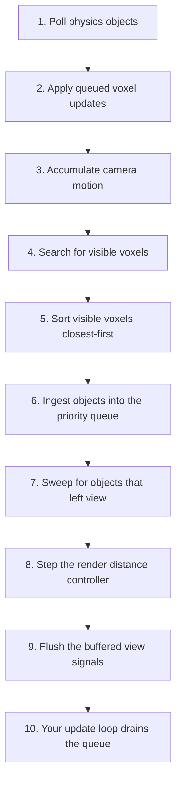

# How CullThrottle Works

This document explains the logic of CullThrottle: what it does each frame, the order it does it in, and why each piece is built the way it is. The [README](../README.md) covers the API, supported object types, and best practices. [MATH.md](./MATH.md) covers the formulas and proofs behind the mechanisms described here.

The goal of this document is that CullThrottle goes from black magic to entirely obvious by the end of it.

## Part I: The problem

### 1. What CullThrottle is for

Suppose your game has fifty thousand objects that each want a small per-frame effect: spinning, bobbing, flickering, pulsing. A frame at 60 FPS gives you about 16 ms for everything the game does, and a loop that merely touches 50,000 objects, before doing any real work on them, already eats a meaningful slice of that. Updating them all every frame is out of the question.

But almost none of those objects are on screen. The player sees a few hundred at a time, and of those, the big nearby ones matter far more than the distant specks. The work you actually need to do each frame is small. The hard part is figuring out which work that is, and doing that fast enough that the figuring saves more than it costs.

That is CullThrottle's job. You give it your objects, and each frame it tells you which objects to update, most important first, cut off by a time budget:

```Lua
for object, dt, distance, cframe in throttle:IterateObjectsToUpdate() do
    -- Advance this object's effect by dt.
end
```

The name CullThrottle describes the two halves. It culls, so objects outside the view never reach you. And it throttles, so among visible objects, update time goes to the most important ones first, and each object earns a refresh rate based on how much it matters right now instead of everything sharing one uniform rate. There are also `ObjectEnteredView` and `ObjectExitedView` signals for effects that only care about appearing and disappearing.

Three terms recur constantly, so here is what we mean by them. Visible means inside the camera's view frustum and within the render distance. Visibility is decided per voxel (a cube of world space, defined in section 4) rather than per object, so it is deliberately a little conservative, and section 8 covers where the per-object refinement happens. Refresh rate is how often a particular object comes back through the update stream. You configure a range (best 60 Hz and worst 15 Hz by default) and CullThrottle moves each object within it. A budget is a per-phase time allowance, checked mid-work, with a defined fallback when it runs out.

### 2. Two ideas that shape everything

Almost every design choice in CullThrottle traces back to one of two principles. Naming them once here saves re-arguing them in every section.

The first idea is that every phase runs under a fixed time budget, and every budget has a graceful fallback. The frame never waits for a perfect answer. Each phase does the most valuable work first (nearest first, most important first), and when its time is up it falls back to an approximate but sane result, reusing stale answers or deferring leftovers. Deferred work gains urgency the longer it waits, so the system is self-balancing and correctness catches up over the next few frames. Section 14 collects every one of these fallbacks in one place.

The second idea is that consecutive frames are nearly identical, so it pays to prove when answers remain true instead of recomputing them. Between two frames the camera usually moves a few studs and turns a fraction of a degree, which means almost every answer about what was visible last frame is still true, and the trick is knowing which ones. Caching answers for a fixed time is wrong (the camera can teleport), and invalidating on any camera change is useless (the camera always moves a little). CullThrottle's answer is to make every visibility test report, alongside its verdict, how much camera motion that verdict provably survives. Checking whether a cached answer is still trustworthy then costs a single comparison. Section 6 builds this up properly.

### 3. One frame at a glance

CullThrottle does its work once per frame, normally in `RunService.PreRender`, though in the on-demand mode (covered in section 10) the frame's first query runs it instead. Here is the whole pipeline as a map. We'll go over this again at the end, after you've learned about each step, so you'll have a full understanding of the work and how it all fits together.



1. Poll physics objects, so parts moved by the physics engine have fresh positions (section 12).
2. Apply queued voxel updates, moving objects between voxels to match where they've gone (sections 4 and 12).
3. Accumulate camera motion, advancing the running totals that every cached visibility answer is judged against (section 6).
4. Search the grid for every occupied voxel that intersects the view frustum (section 7).
5. Sort the visible voxels closest-first (section 8).
6. Ingest the objects in those voxels, scoring them into a priority queue (section 8).
7. Sweep for objects that have stayed out of view long enough to count as gone (section 10).
8. Step the render distance controller, growing or shrinking the render distance based on how the budgets are holding up (section 11).
9. Flush the entered and exited view signals buffered during the frame (section 10).
10. This belongs to you: whenever your code iterates `IterateObjectsToUpdate`, it drains the queue under its own budget and runs your loop (section 9).

## Part II: Deciding what's visible

### 4. Dividing space: voxels and buckets

Testing each object against the camera individually is exactly the 50,000-iteration loop we said we can't afford. So CullThrottle doesn't decide visibility per object at all. It divides the world into a uniform grid of cubic voxels, each 100 studs on a side by default, and decides visibility per voxel. Objects are assigned to the voxels they occupy, and when a voxel is visible, its objects become candidates for updating. The cost of visibility now scales with how much occupied space the camera can see rather than with how many objects exist. A thousand objects packed into one room cost only one voxel verdict.

Which voxels does an object occupy? Most objects are small relative to a 100 stud voxel, so they live in exactly one, the voxel holding their center, and moving across a boundary is a cheap single reassignment. The single voxel is a slight simplification, since a small object can poke past it into a neighbor, but the overhang is bounded at a quarter of the voxel size (that bound is exactly the threshold below which an object counts as small), and a sliver that thin only matters for an object hugging a voxel boundary at the very edge of the view. An object whose bounding radius passes that threshold instead occupies every voxel it overlaps. The subtlety is that its bounding box is oriented. For a long part rotated 45 degrees, the world-aligned box around it bulges far past the real shape, and filling that box would claim corner voxels the object doesn't touch. So the world-aligned box only nominates candidate voxels, and a separating-axis test kicks candidates that it can prove don't touch the object (detailed in [MATH.md](./MATH.md)). The test checks the box's own face axes and skips the edge-to-edge cross axes a full check would add, so it can keep a thin sliver of corner voxels the box doesn't quite touch. That error direction is deliberate, since an extra voxel costs a little bookkeeping while a wrongly excluded one could hide an object from the search.

One more layer sits on top to help this scale. Each frame the search must find occupied voxels near the frustum, and at a large render distance the frustum's bounding box can span tens of thousands of voxels, likely nearly all empty. Scanning empty space is pure waste, and it grows cubically as the render distance grows. So occupied voxels are also indexed into coarse buckets, where each bucket covers a 4x4x4 block of voxels, and the grid maintains a bounding box around the occupied buckets. The per-frame scan walks only the bucket coordinates inside both the frustum's bounding box and that occupied-bounds box, where an empty coordinate costs one missed table lookup and an occupied bucket hands over only the voxel keys that actually hold objects. The bucket layer makes that walk 64 times coarser than scanning voxels directly, and the occupied-bounds clamp keeps a long render distance from expanding the search range past where anything actually is.

```txt
+-----------------------------------------+
|  the bounding box of occupied buckets   |
|                                         |
| +=========+=========+       +=========+ |
| | x . . . | . . . . |       | . . x . | |
| | . x . . | . . . x |       | . . . . | |
| | . . . . | . x . . |       | . x . . | |
| | . . . . | . . . . |       | . . . . | |
| +=========+=========+       +=========+ |
|   bucket    bucket            bucket    |
|                                         |
+-----------------------------------------+

x = an occupied voxel. Empty voxels and empty buckets are
not stored, so an empty coordinate costs the scan one missed
lookup, and the outer bounds keep a long render distance
from dragging the scan past where anything actually is.
```

To keep the spatial words straight from here on, a voxel always means the small grid cube, a bucket always means a 4x4x4 group of voxels, and a box is any plain geometric shape being handed to a test. Section 7 adds the last spatial term, the search volume, for a box of space the search is still working on.

How the grid stays correct as objects move, resize, and despawn is bookkeeping, and it's covered with the rest of the lifecycle machinery in section 12. For now, let's assume every object is in the right voxels.

### 5. The frustum test, and what it really returns

Now that we have voxels and buckets, we need a way to ask whether a given box of space is on screen.

The camera's view is a frustum, a pyramid spreading out from the camera. CullThrottle describes it with five planes: left, right, top, bottom, and far, where the far plane sits at the render distance. There is no near plane because the four side planes all pass through the camera position, so everything behind the camera already fails at least one side test. A near plane would be a sixth test that rejects nothing new. Testing if something intersects with this frustum tells us if it is in view.

The frustum planes are built once per frame directly in voxel coordinates (positions divided by the voxel size, while normals are unchanged by uniform scaling), so every test works on voxel-space boxes with no unit conversion. Per box, a cheap bounding-sphere comparison settles the clearly-inside and clearly-outside cases, and only when the sphere straddles a plane does the exact box projection get computed. [MATH.md](./MATH.md) covers these in more detail.

Our visibility test doesn't return a bare "inside" or "outside" result. Alongside every verdict it returns the clearance that proves it, which we'll call "slack". An outside verdict comes with how far beyond the rejecting plane the box sits. An inside verdict comes with how far inside the nearest plane the box sits. And a box straddling a plane gets its exit clearance, meaning how far the planes would have to sweep before the box could fall entirely outside.

```txt
                far plane
+--------------------------------------+
 \                                    /
  \                +-----+           /
   \               | box |- slack ->/
    \              +-----+         /
     \                            /
      \                          /
                . . .
               (camera)

The box is inside all five planes, with this much room to
spare before the nearest one.
```

A verdict with slack is a verdict with a shelf life: it stays provably true until the camera has moved enough to use up the slack. Let's turn that observation into a cache mechanic.

### 6. Remembering what we proved: motion proofs

The camera moved a little since last frame, which means almost every voxel's verdict is still true. Which ones can we trust without re-testing? This is the centerpiece of the whole system, so let's build it up step by step.

Slack is a motion allowance. A box proven inside the frustum with 3 voxels of clearance stays inside under any camera motion that shifts the planes by less than 3 voxels relative to it. It doesn't matter whether the camera slid, turned, or zoomed, as long as the total plane sweep can be bounded. So a verdict plus its slack reads as "valid until the camera has moved more than this much". The same holds for outside verdicts and their rejection margins.

CullThrottle keeps three running totals of camera motion since the cache was last reset: translation (in voxel units), rotation (in radians), and render distance change (tracked separately because changing render distance moves just the far plane of the frustum). These accumulators are one-way odometers that only ever increase. Changes to the field of view or the viewport aspect ratio pivot the side planes about the camera by the change in half-angle, so projection changes are charged to the rotation odometer too (picture shrinking the field of view as rotating all frustum side planes inward).

Rotation can't be charged at a flat rate, because how far it sweeps the planes depends on distance. One degree of camera turn barely moves the planes relative to a voxel right next to the camera, but sweeps them a long way past a voxel 2,000 studs out, the way the far end of a lighthouse beam moves faster than the near end. So each proof charges rotation at its own arm, the voxel's distance from the camera. But translation could carry the camera away from the voxel while the proof is alive, lengthening the arm, so the stored arm is padded by the allowance itself, keeping the charge an overestimate in every reachable case. [MATH.md](./MATH.md) has the soundness argument.

Checking a proof's validity comes down to a single comparison. Rather than storing the slack and reconstructing what motion happened since, each proof is stored as an expiry, the odometer reading beyond which it can no longer be trusted. Checking a proof means taking the current translation total (plus the render distance total), adding the rotation total multiplied by the proof's arm, and comparing against the expiry. That multiply, add, and compare is the entire cost of reusing last frame's still-valid work, which is what makes the cache so much cheaper than even the cheapest intersection test.

The error direction is always "expire early". Per-voxel proofs are packed three-to-a-`Vector3`, holding a visible expiry, a culled expiry, and the arm. A proof only ever carries one verdict at a time, so the other expiry slot holds a sentinel saying it proves nothing in that direction. `Vector3` components are 32-bit floats, and rounding could nudge an expiry either direction, so every stored clearance is shaved by a small safety margin (0.01 voxels) before storing. The clearance is also capped (8 voxels) to limit how much the arm's padding and how stale the proof can grow. A proof can expire sooner than the math strictly requires, never later. A wrong "expired" costs one redundant test, while a wrong "still valid" would cause a real visibility bug. And when no motion bound can relate the old planes to the new ones at all, the cache doesn't try to be clever. It drops everything and re-anchors the odometers at zero. That happens when the camera object is replaced, when the voxel size changes (every cached quantity is in voxel units), and when the odometers grow large enough that f32 precision could eat into the safety margin (roughly 16,000 voxels of translation and render distance change combined, or 64 radians of turning). The price is one cold frame, which the budgets absorb as designed.

Proofs are cached at two granularities. Each voxel gets the packed proof described above. All three of its slots are spoken for, leaving no room to split clearances by plane, so a render distance change charges voxel proofs at full weight, the same as translation. Each bucket can also cache a verdict for its whole box, but only the two durable states, fully outside or fully inside. Bucket verdicts live in plain table fields rather than a packed `Vector3`, so they skip the cap (there's no packing precision to guard) and they keep side-plane and far-plane clearances separate, which lets a render distance change (it moves only the far plane, and section 11 explains why the render distance is always changing) spend only far clearance. A bucket straddling the frustum boundary has no durable verdict, since the smallest motion can flip individual voxels inside it, so straddling buckets are simply re-searched for as long as they straddle.

### 7. The search: spending the budget cheapest-proof-first

Now we have a grid (section 4), a test that yields durable proofs (section 5), and a cache of proofs with one-comparison validity (section 6). The search's job is to find every visible occupied voxel in under a millisecond (0.8 ms budget by default). It runs in three layers, ordered so that the cheapest possible resolution handles as much space as possible.

The first layer seeds from the buckets. The search scans the occupied buckets inside the frustum's bounding box (clamped to the occupied bounds). A bucket with a still-valid cached verdict resolves in two comparisons: culled means skip it entirely, and inside means bulk-append every voxel key in the bucket to the visible set. The verdict is about the bucket's box, so it even covers voxels that became occupied after the verdict was proven. A bucket with no valid verdict gets its full box classified by the frustum test, and a fully outside or fully inside result is cached with its clearances and resolved on the spot. Only a straddling bucket generates real work. Its voxel keys are copied into a shared buffer, and a root search volume owning that contiguous slice of the buffer is pushed onto a stack. A search volume is a box of space the search hasn't settled yet, paired with the buffer slice holding the occupied voxel keys inside it.

In a typical frame the vast majority of buckets are either far outside the view or comfortably inside it, so this layer resolves most of the world for a couple of comparisons per bucket. What survives is the thin shell of buckets straddling the frustum boundary.

The second layer subdivides the straddling volumes. Volumes pop from the stack and resolve one of two ways. The cheap way is a proof walk, which checks each voxel in the volume against its cached proof. Still-valid visible voxels are appended, still-valid culled voxels are skipped, and unproven voxels (expired or missing proofs) are collected. When only a few turn up unproven (within a margin of 4 of the proven count), the walk re-tests just those and the volume is done. When unproven voxels pile up past that margin, the walk bails and the volume's whole box is frustum-tested instead, since one box test covers them all more cheaply than testing each voxel alone. A fully outside result stamps every voxel in the volume with a culled proof carrying the box's rejection margin, each charged at its own arm. A fully inside result stamps them all visible with the box's slack the same way. A still-straddling result splits the box roughly in half along its longest axis and partitions the slice in place. Inheritance keeps this recursive search cheap. A child only re-tests the planes its parent straddled (if the parent was fully inside of a plane, the child is too and can skip it) and it carries the smallest slack its ancestors proved, so proofs stamped deep in the tree don't wastefully re-test planes but still have the slack correctly bounded by every plane.

```txt
a search volume's keys live in one shared buffer slice:

  [ k1  k2  k3  k4  k5  k6 ]     the search volume owns this range of the buffer

A straddling result splits the box along its
longest axis and partitions in place:

  [ k2  k5  k1 | k6  k3  k4 ]
      child A      child B       each child volume owns its sub-slice for the next test
```

The third layer is single voxels, where a volume clipped down to one voxel trusts a still-valid proof of either verdict, or frustum-tests the voxel and stamps a fresh proof.

Two more measures cover the search when the budget can't finish. The first is the budget fallback. The clock is checked every few volumes (reading the clock itself costs something so we don't check after every single volume), and when the budget runs out with volumes still on the stack, each of their voxels is re-marked visible if its last proof was a visible verdict, without checking if the proof is still valid. Assuming it's still visible is our best option because an object flickering invisible for a frame is far worse than spending an update on something that just slipped out of view. The number of voxels handled by this fallback is recorded, and section 11 explains who's watching that number. The second safety measure is a fairness rotation. The stack is last-in-first-out, so the top volume gets the front of the budget. A counter rotates which root volume goes first each frame and flips the order children are pushed in, so if the budget chronically can't finish, every straddling volume takes turns being searched fresh instead of one corner of the view monopolizing the budget while another runs permanently on stale proofs.

## Part III: From visibility to your update loop

### 8. Ingest: turning visible voxels into priorities

The search has now produced our visible voxels. Inside them might be thousands of objects, and the consumer can update a few hundred per frame. Which objects should they update?

Before any object is touched, the visible voxels are sorted closest-first by Manhattan distance in voxel units. The distances are small non-negative integers, so a counting sort does it in linear time. This ordering is the ingest pass's safety net: whatever happens with its budget, the time goes to the nearest voxels first.

Then CullThrottle walks the voxels and scores every object inside. An object spanning several visible voxels is scored only once per frame (a check stamp dedupes it). The score blends three terms, weighted heuristically by how much each tends to matter. Screen size carries a weight of 85, since the larger an object looms on screen (its radius over its distance), the more it contributes visually, so it should refresh fastest. Refresh urgency carries a weight of 13 and measures how close the object is to its worst allowed refresh period, dragging everything toward a fair share so small objects don't starve entirely. Distance carries a weight of 2, a light thumb on the scale to prefer nearer objects when screen sizes are similar, since near objects are likelier to be what the player is looking at.

Three conditions overrule the blended score, checked in this order:

1. An object updated within the best refresh period doesn't need anything yet, so it's pushed into a far-back tier for over-refreshed objects (a screen-size priority scaled by a factor of a million) where it sorts behind everything that actually needs work.
2. An object overdue past the worst refresh period becomes p0, aka must-refresh-this-frame, sorted ahead of everything else (p0s order among themselves by screen size).
3. An object within 30 studs of the camera goes near the front regardless of size, since things right under the player's nose should update nearly every frame.

Each object's refresh clock also carries a small random jitter (up to 2 ms either way), assigned once when the object was added. Without it, a thousand objects spawned on the same frame would cross their refresh thresholds in lockstep forever, arriving as a thundering herd every few frames instead of spreading out.

Because voxel-level visibility is conservative (a visible voxel can contain objects that are themselves out of view), each object is re-culled individually. If it's beyond the render distance or fully outside the frustum, it's skipped.

When the ingest budget runs out during the scoring walk, the fallback approximation takes over. Every object in the remaining voxels is dumped into the queue behind the properly ingested objects with a coarse priority derived from its voxel's position in the closest-first sorted order, so nearer voxels still sort ahead of farther ones. Objects dumped by this fast pass may still need updates this frame, so even the deepest of them still sorts ahead of the far-back tier of objects that were updated within the best refresh period.

This gives us priority bands, each with a sub-sort within themselves:

1. p0 objects, sorted by screen size
2. Very nearby objects, sorted by distance
3. Ingested objects, sorted by score
4. Fallback dumped objects, sorted by voxel distance
5. Over-refreshed objects, sorted by screen size

The last two bands sit strictly behind everything above them, while the first three are intent rather than hard walls. Very nearby objects score in the same numeric range as the p0s on purpose, so the closest of them count as p0 for the update loop's budget rules (section 9), and at the extremes the bands can interleave. The bands exist to put the right objects first, not to wall the tiers off from each other.

Everything lands in a priority queue (lowest value dequeues first) as a cheap staging append. Nothing is heap-ordered yet, just put into a staging batch.

### 9. The update loop: what the consumer sees

We got our voxels, we got the objects from the voxels, and the update queue is staged, so now it has to fit in your frame.

`IterateObjectsToUpdate` heap-orders the staged batch on the first iteration of the frame rather than during ingest, so frames where nobody iterates never pay for the sort. From there the iterator dequeues in priority order, checking the clock as it goes against the update budget (0.4 ms by default), and when the budget runs out, iteration just ends.

The p0 band gets special treatment at the budget cutoff. While the front of the queue is p0 objects, the iterator allows itself to overrun the budget by 15%, so a frame stacked with overdue objects mostly keeps up with the worst refresh rate. If you've enabled `strictlyEnforceWorstRefreshRate`, p0 objects ignore the budget entirely, trading frame time for a guaranteed minimum refresh rate.

Whatever doesn't get updated stays un-refreshed, so its urgency score is higher next frame, and if it keeps missing, it eventually becomes p0 and jumps the line. This is the self-balancing loop closing. Budgets shed load, the scoring system turns shed load into priority, and nothing visible starves. Under sustained pressure, refresh rates degrade smoothly across the board instead of some objects freezing.

A few practical notes round this out. Entries for objects removed mid-frame are skipped at dequeue (removal doesn't dig through the queue). The iterator yields `(object, dt, distance, cframe)`, where dt is the real time since that particular object's last update, which is what your effect should advance by, and the distance and cframe are values CullThrottle already computed this frame, handed over so you don't pay to read them again. `GetVisibleObjects` taps the same once-per-frame machinery and returns an unsorted snapshot without consuming the queue.

### 10. Visibility signals

Some effects don't need a per-frame update and only need to know when an object appears and disappears. That's what `ObjectEnteredView` and `ObjectExitedView` are for.

Entering is detected during ingest. Every visible object gets its last-visible clock stamped, and the stamp flipping from zero to nonzero means the object just came into view, so an entered event is buffered. Exiting needs more care. An object straddling the frustum edge while the player's head bobs or render distance finds equilibrium would enter and exit every few frames, firing a storm of signals for no real change. So the exit sweep at the end of the frame gives every object a short grace period (0.2 seconds), and only after staying unseen that long does it buffer an exited event. An object lingering in its grace period is not in `IterateObjectsToUpdate`/`GetVisibleObjects`, since it isn't actually visible. The grace period only applies to events, and re-entering during the grace does not fire an entered event, preventing the other half of that storm of signals and avoiding confusing "entered without exiting first" events.

Both signals are buffered during the frame and fired together at the very end, after all of CullThrottle's own iteration is finished. This makes it safe for an event listener to add or remove objects without corrupting a loop in progress. The flush order is a contract: every entered event fires before any exited event. Objects you remove from CullThrottle are evicted silently. `ObjectRemoved` covers the announcement, and a trailing exited event would be spurious.

This is also where the on-demand mode hangs together. With `computeVisibilityOnlyOnDemand` enabled, the whole pipeline idles until something asks for results, and a connected view signal counts as standing demand (entered/exited can only fire if visibility gets computed). Skipped frames are safe because the motion odometers only need the endpoint poses. However long the gap, the accumulated motion since the last processed frame is exactly what the proofs get charged.

### 11. The pressure valve: dynamic render distance

The budgets are fixed, but scenes aren't. Walk from an empty field into a dense city and the same budgets that left headroom now blow every frame, leaving the system permanently in its fallback paths: stale search results, coarsely-prioritized ingests, starved updates. The fallbacks are built to absorb transients, and living in them permanently defeats their purpose. Something has to give, and render distance is the one knob that scales every phase at once. It bounds how much space the search covers, which bounds how many voxels the ingest pass scores, which bounds the queue the update loop drains.

So the render distance floats. You configure a range (150 to 2,000 studs by default), the live distance starts at its midpoint, and a controller nudges it every frame. The controller watches three load signals. The search and ingest costs are each normalized against their budgets, and the third signal measures how the objects updates are faring using the average refresh period normalized against the midpoint of the configured refresh range. Each load is weighted by how painful its overrun is (search 1.3, ingest 1.0, refresh pace 0.8) and the worst weighted load drives the decision. The render distance shrinks when that load passes 1 (the weighting means search trips this somewhat below its raw budget), or when search or ingest had to fall back in any of the last four frames (stale verdicts for search, the coarse dump for ingest). It grows when the worst load is under 0.6 and no fallbacks were needed in the last four frames (so a single bad frame briefly keeps pressure rather than being instantly forgotten). In between those thresholds the controller holds the render distance steady.

The amount the render distance moves each frame adapts rather than staying constant. The step grows while the controller keeps moving in the same direction, since a sustained push means the scene really changed and it should catch up fast, and it shrinks sharply when the controller reverses or settles so the distance doesn't bounce around the equilibrium. The result is a distance that converges to whatever the current scene can afford and breathes slowly as that changes.

If you set a zero-width range, the distance is pinned to that value and the controller stays out of it.

## Part IV: Supporting machinery and the full picture

### 12. Keeping the grid current: lifecycle and maintenance

Everything so far assumed the voxel grid reflects reality. Objects move, resize, reparent, and get destroyed, so something has to keep that true, and it has to do it without scanning the object list (that would be the forbidden 50,000-iteration loop again).

The answer is to be event-driven everywhere events exist. When an object is added, CullThrottle resolves where its position and bounding box come from (the object itself, or the nearest ancestor that has them, with the per-class rules in the README's object types table) and subscribes to the matching property-changed signals. From then on, geometry updates cost time in proportion to how much actually changes. Fifty thousand motionless objects cost nothing to keep current. Reparenting re-resolves the sources and rewires the listeners, and a destroyed source untracks the object automatically rather than letting it haunt the grid with frozen data.

The exception is physics, since parts moved by the physics engine don't fire property-changed events. That's why they're registered separately (`AddPhysicsObject`) and CullThrottle polls them. The poll is round-robin under a small fixed budget (0.05 ms per frame), resuming each frame where the last one stopped, so a large physics population refreshes over several frames at a bounded per-frame cost. Only a part that actually moved pays for anything beyond the read.

When an object's geometry does change, its new voxel set isn't applied on the spot. The desired set is computed, diffed against the current one (just the enters and leaves survive), and the object joins a queue ordered by distance to the camera. The maintenance step at the top of each frame (step 2 in the pipeline) drains that queue closest-first under its own 0.05 ms budget, and whatever doesn't fit under budget stays in the queue for next frame. By now this should look familiar, since it's the same budget-plus-priority shape as everything else, applied to bookkeeping. Correctness where it's visible comes first, and a teleporting object on the far side of the map can be a frame late in the grid without anyone noticing.

### 13. The full frame, precisely

Let's look at the pipeline from section 3 again, now with our full context and understanding.

1. Poll physics objects (0.05 ms). Physics-driven positions refresh before anything reads them, so the rest of the frame works on the freshest data available.
2. Apply queued voxel updates (0.05 ms, closest-first). The grid must be current before the search trusts it.
3. Accumulate camera motion (cheap, unbudgeted). The odometers must advance (or flush, on a camera swap) before a single cached proof is consulted, or every validity comparison this frame would be against stale readings.
4. Search (0.8 ms). This is the work of sections 5 through 7.
5. Sort visible voxels (unbudgeted, a linear-time counting sort). Closest-first ordering must exist before ingest so its budget is spent nearest-first.
6. Ingest (1.2 ms). This stages the priority queue and stamps the visibility clocks that entered-view detection reads.
7. Sweep for exits (unbudgeted, touches only in-view objects). It runs after ingest so this frame's sightings count before anyone is judged gone.
8. Step the render distance controller (cheap). It consumes the durations and skip counts the earlier phases just recorded.
9. Flush view signals (the cost belongs to your handlers). This comes after all internal iteration is done, so handlers can freely mutate the tracked set. The frame is marked processed just before the flush so a handler that re-enters (like by calling `GetVisibleObjects`) short-circuits instead of recomputing.
10. Your update loop runs whenever you iterate (0.4 ms, with the p0 overrun rules from section 9).

Everything runs at most once per frame, triggered by `PreRender` normally or by the frame's first query in on-demand mode, where steps 1 through 9 simply don't run on frames where nothing demands them.

The upkeep and ingest budgets are each anchored at their own clock reading when their phase begins. The search budget is the exception, measured from the frame's entry, so the upkeep and motion accumulation ahead of it spend out of its allowance and the search budget effectively caps everything that happens before ingest. With the default budgets, CullThrottle's own managed work tops out a bit over 2 ms per frame at worst, plus the 0.4 ms your iteration spends. The search, ingest, and update budgets are yours to tune with `SetTimeBudgets`, while the two upkeep budgets are small fixed constants.

### 14. Why it never falls over: degradation paths

The real test of trust in a budgeted system is what happens on a bad frame. Here is every budget and its fallback in one place.

| Phase | Budget | When it runs out | How correctness catches up |
| --- | --- | --- | --- |
| Physics poll | 0.05 ms | Stops mid-list | Round-robin resumes exactly where it stopped next frame |
| Voxel maintenance | 0.05 ms | Remaining membership diffs stay queued | Closest objects were applied first, and the rest apply next frame |
| Search | 0.8 ms | Unreached volumes reuse each voxel's last visible verdict, even expired | Skipped counts pressure the render distance down, and the fairness rotation gets those volumes a fresh search within a few frames |
| Ingest | 1.2 ms | Remaining voxels dumped at coarse, closest-first priority | Objects still update this frame, just less precisely ordered, and the skips feed the controller |
| Update | 0.4 ms | Leftover objects go un-updated | Their urgency rises next frame, and persistent misses become p0, which may overrun the budget by 15% (or without limit in strict mode) |

A few events bypass the budgets entirely and force a cold start. A camera swap, a voxel size change, or the motion odometers reaching their precision limits all flush every cached proof. The next frame searches cold, leans harder on its budget fallback than usual, and the caches rebuild over the following frames. One cold frame is the designed cost of those events.

Notice the two ideas from section 2 in every row. Each fallback degrades the precision of prioritization or the freshness of a verdict while keeping the core promise intact: every visible object keeps updating, at worst more coarsely ordered or a frame stale, and overdue objects always force their way through. And the fallbacks aren't load-bearing at equilibrium, because hitting them feeds the render distance controller alongside the phase costs. Chronic pressure shrinks the render distance until the work fits its budgets again. Transient spikes get absorbed by fallbacks, and sustained ones get resolved structurally.

### 15. Where the math lives

Everything above stated what is computed and why. [MATH.md](./MATH.md) covers how, with the formulas and the proofs. The geometry comes first: building the five frustum planes from the camera, the move into voxel coordinates, and the box-versus-planes test with its bounding-sphere prefilter, its exact projection interval, and the way slack and exit clearance fall out of it. The motion-proof math follows: why charging rotation at the arm is a sound bound, why the arm is padded by the proof's own slack, the expiry encoding behind the single-comparison validity check, and the error analysis behind the slack cap, the safety shave, and the f32 limits that set the odometer flush thresholds. The rest covers the supporting algorithms: the oriented-box voxel fill and its separating-axis argument, the counting sort over Manhattan distances, the priority formula with its weights, bands, and tier arithmetic, and the render distance controller's load normalization and step adaptation.
